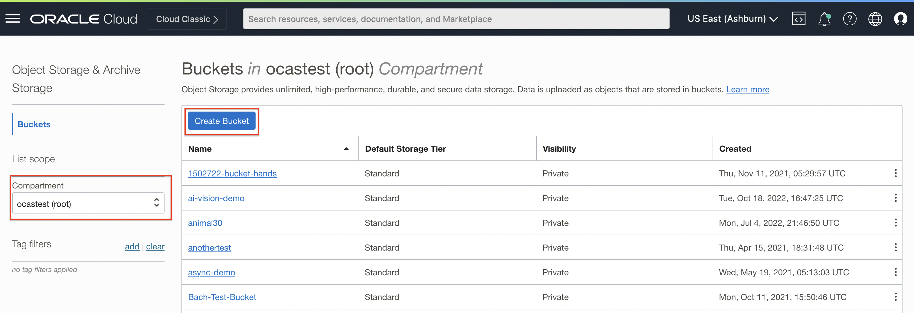
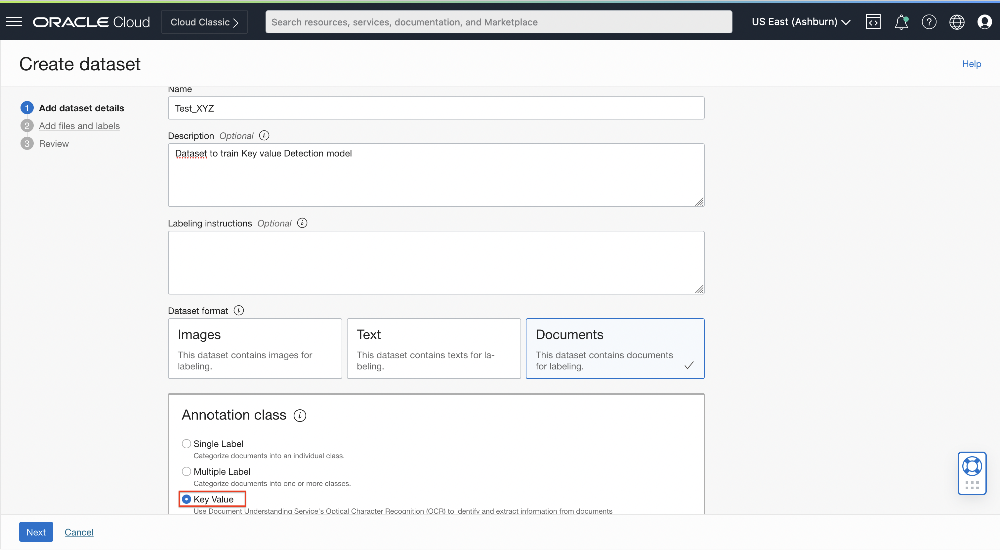
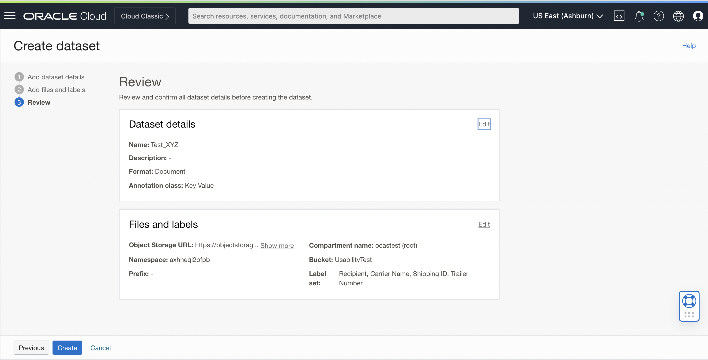
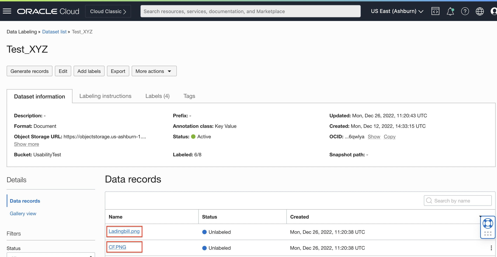
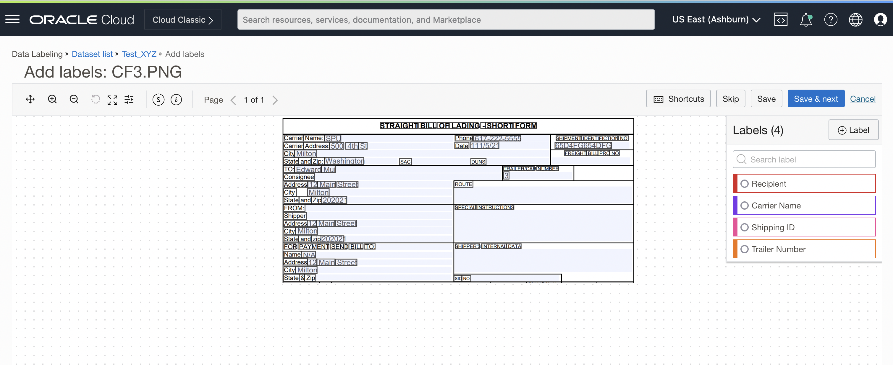
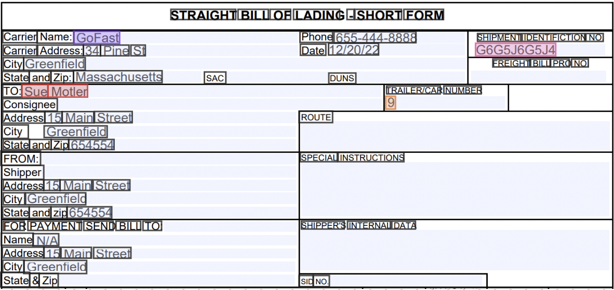
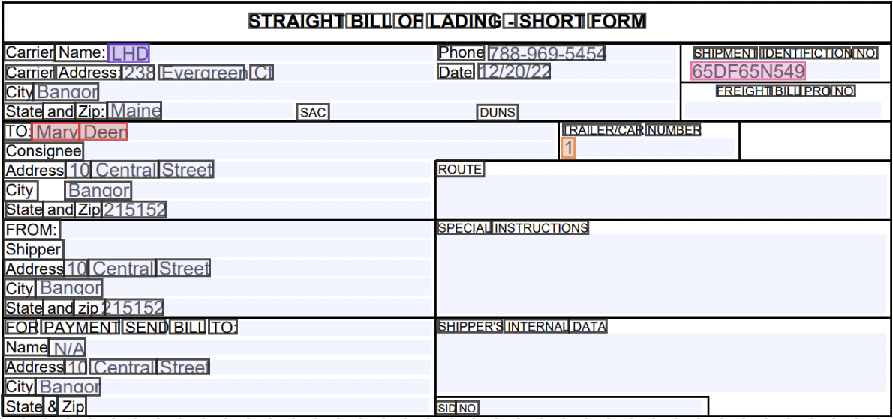
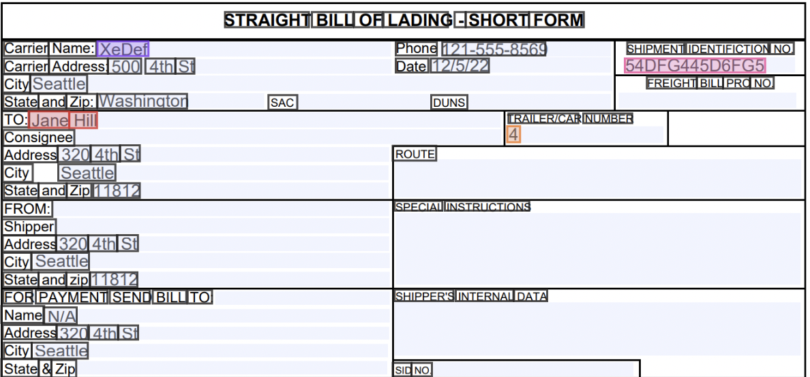

# Lab 1: Label a dataset in OCI Data Labeling Service
## Introduction

In order to train a custom key value model using Document Understanding, you need a labeled dataset. In this lab, you will use the OCI Console to a create dataset in Data Labeling Service.

Estimated Time: 20 minutes

### Objectives

In this workshop, you will:

* Create an Object Storage Bucket to store the data.
* Get to know how to create a new dataset for Key Value Extraction model. 
* Label the documents in the created dataset.

## **Task 1:** Create an Object Storage Bucket (Optional if you already have an Object Storage bucket)
* Using the Burger Menu on the top left corner, navigate to Storage and select **"Buckets"** under the Object Storage section.

* Then, Select Compartment from the left dropdown menu.
* Click Create Bucket.

* Fill out the dialog box:

  * Bucket Name: Provide a name of your choice(e.g: UsabilityTest)
  * Storage Tier: STANDARD

* Then click Create.

## **Task 2:** Create a new Dataset for a Key Value Extraction Model

You will be creating a custom key value extraction model for this session with documents from the [data folder](./data).

Create a new dataset with the following guidelines:
* Navigate to **Data Labeling Page** on OCI Console.

* On the Data Labeling Page, select **"Datasets"** on the left navigation menu and click on **"Create dataset"**.

* Under the name section, provide any name to your dataset(For e.g: "Test_YourName").
* This will be a key-value extraction dataset.

* Choose to upload these documents as local files.

* Choose the destination-bucket(created in Task1) to save the dataset.
  Uploaded dataset from local will automatically get saved inside the selected bucket along with all the existing data.

* Upload the files to be labelled in the section **"Selected files"** shown below.

* In the labels section, add the names of all the fields you want supported in your custom key value model. In this scenario, we want to train a key value model that detects recipient, carrier name, truck number, and shipping number from a bill of lading document. So, in the Labels section we'll add the fields **"Recipient", "Carrier Name", "Shipping ID",** and **"Trailer Number"**, pressing "enter" after each name. 

* Review and click on **"Create"**.

## **Task 3:** Label the documents in your Dataset

Now that your dataset is generated, begin labelling your dataset. Select the document which you want to annotate by clicking on its name.

* Start labelling all the labels. Note: you don't need to label field names, like "Shipping ID" in a document, just the values, like "5102353." You can also associate multiple words to a given label, like the first and last name to "Recipient."

* Click on the specific word to label it.

* To label multiple words with the same key, annotate it multiple times by clicking on each word.

  1. Recipient

  2. Carrier Name

  3. Shipping ID

  4. Trailer Number

* You can validate the labelled values by going to the summary dashboard by clicking on Ⓢ icon.

* Annotate all 6 documents.

## **Summary**

Congratulations!  
In this lab, you have learnt how to create a dataset and how to annotate document for key value extraction.

You may now **proceed to the next lab**.

[Proceed to the next section](./lab-02-model_training.md).
